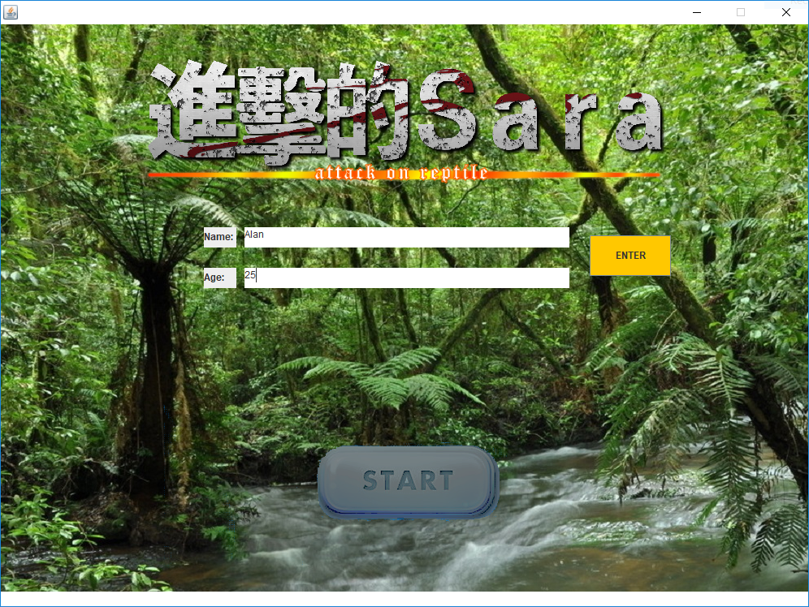
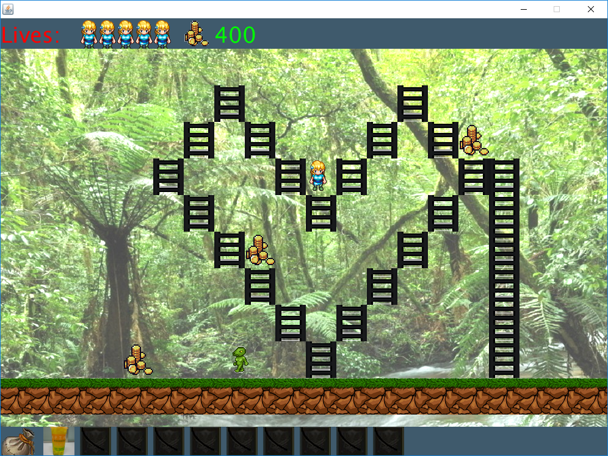
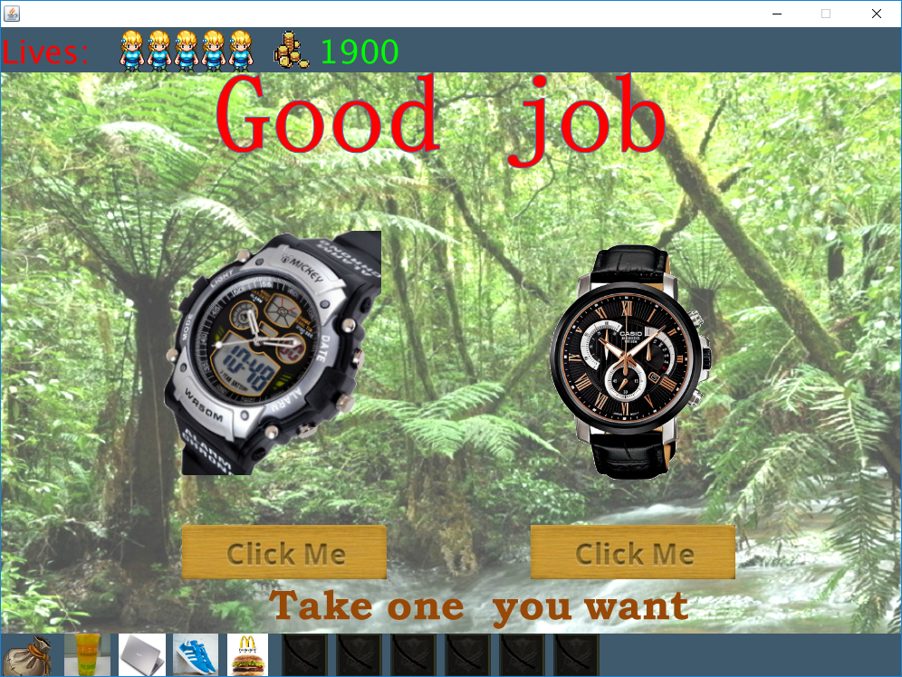
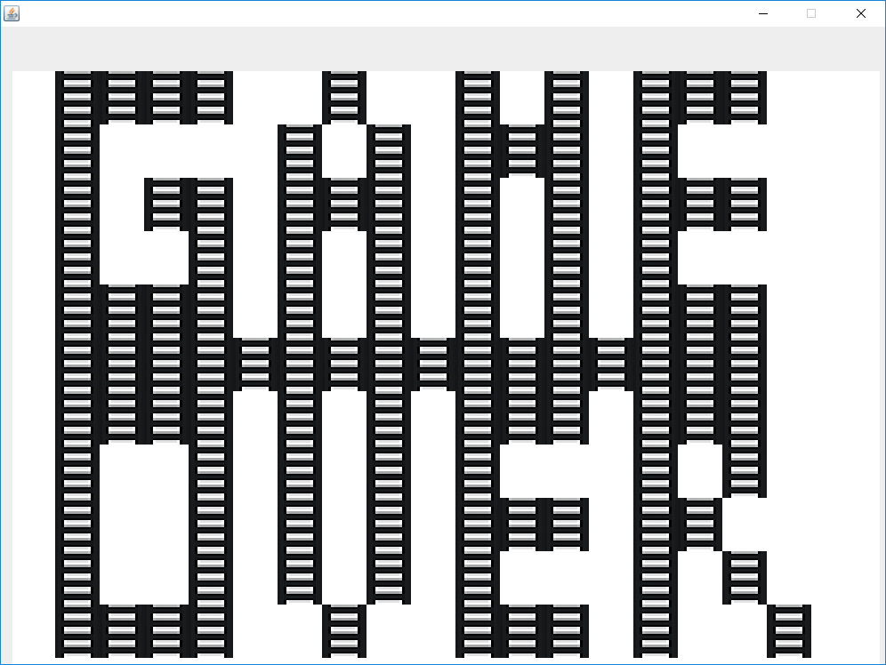
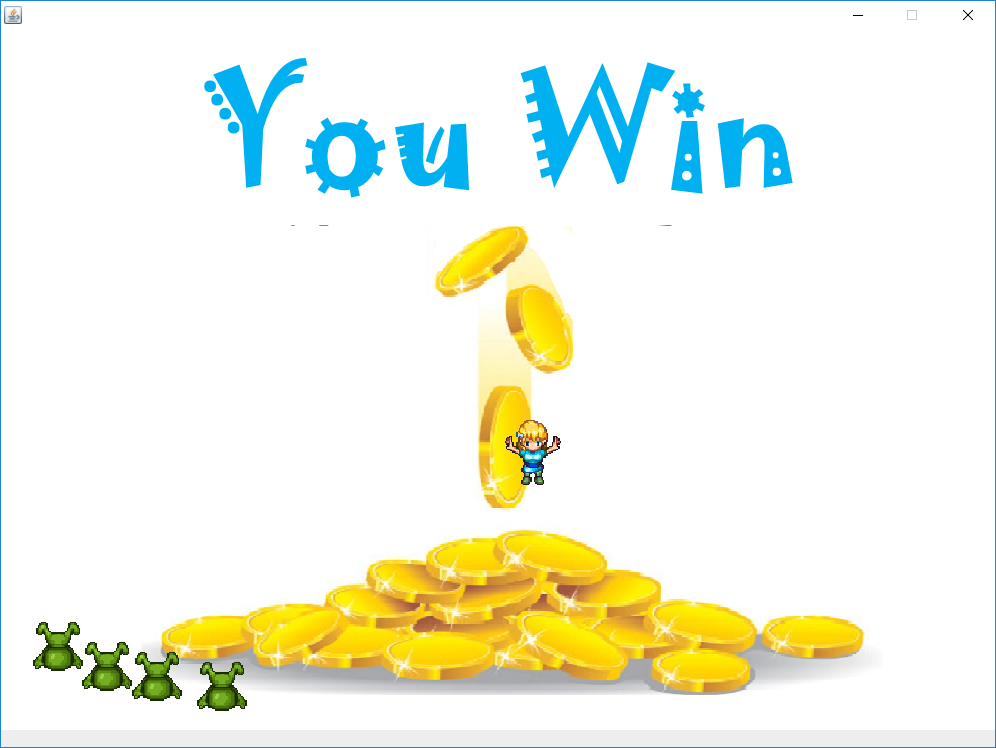
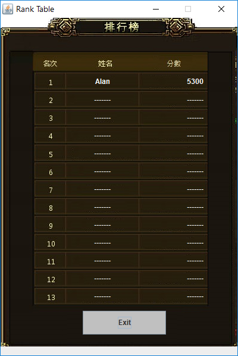
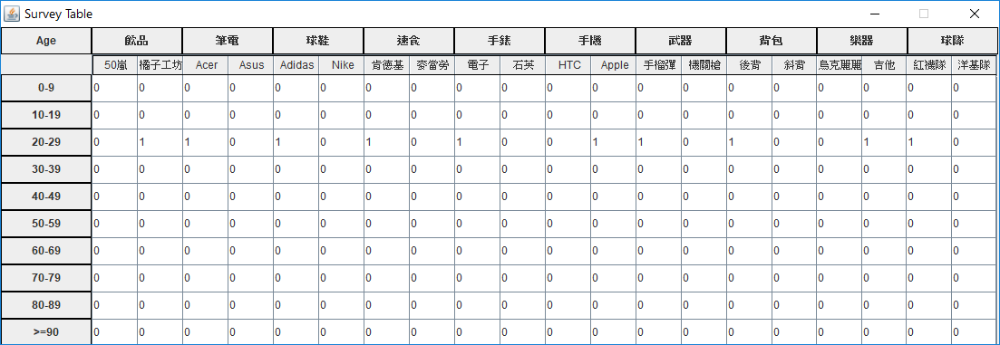

# 淘金者 (Lode Runner Application)

類別：課程期末分組專案 
課號：NTHU, 10310 CS241001, 軟體實驗 (Software Studio) 
時程：2014 年 12 月 ~ 2015 年 1 月，為期 6 週 
簡介：大二程式設計課的期末專案，實作知名遊戲 － [淘金者](http://loderunnerwebgame.com/game/)，藉此練習 JAVA 大型程式撰寫技巧。[PApplet](https://processing.github.io/processing-javadocs/core/index.html?processing/core/PApplet.html) 方便操作動畫的特 
　　　性也讓它扮演著重要角色，是讓遊戲順利進行不可或缺的關鍵。相鄰關卡之間會讓玩家從二個商品中選一個較喜歡的， 
　　　目的在於調查不同年齡層對於不同商品的喜好，這種將目的順勢導入的[遊戲化手法 (Gamification)](http://sdachen.blogspot.tw/2013/10/what-is-gamification.html) 也是課程重點內容。 
　　　既然是遊戲，那麼題材的選取、畫面的美工、程式流程的發想等工作都是非常重要的，缺一不可。 

---

## 環境設定與編譯 (Getting Started)

#### 執行平台 (Platform)

本專案由 JAVA 程式語言實作，可在任何裝有 JRE (Java Runtime Environment) 的平台上執行。

#### 先備環境 (Prerequisites)

1. 若要從原始碼自行編譯，需要先行安裝 [JDK (Java Development Kit)](http://www.oracle.com/technetwork/java/javase/downloads/jdk9-downloads-3848520.html)；若僅僅要執行遊戲，只需要安裝 JAVA 執行平台 [JRE (Java Runtime Environment)](http://www.oracle.com/technetwork/java/javase/downloads/jre9-downloads-3848532.html)。JDK 已包含 JRE，已安裝 JDK 者毋須再安裝 JRE。有關於其他安裝細節請參考官網說明。

2. [執行檔](https://github.com/alan23273850/Lode-Runner-Application/releases/latest)已發布，可直接下載。由於每次遊戲結束後會在同一層資料夾底下產生記錄資料，建議開始第一次遊戲前能先行將執行檔置於乾淨資料夾，以免記錄資料與其他不相關的檔案混淆。

#### 編譯與執行 (Compile & Execute)

＊專案根目錄已附上適用於 Linux 平台之 Makefile：
1. 在終端機輸入 `make clean` 清除編譯後之資料夾 out/ 及相關執行檔 *.jar、記錄檔夾 stat/。
2. 在終端機輸入 `make` 或 `make all` 編譯出結果資料夾 out/ 及三個獨立的執行檔 Game.jar、Rank.jar、Survey.jar。
3. 在終端機輸入 `make game` 可僅編譯出結果資料夾 out/ 及 Game.jar。
4. 在終端機輸入 `make rank` 可僅編譯出結果資料夾 out/ 及 Rank.jar。
5. 在終端機輸入 `make survey` 可僅編譯出結果資料夾 out/ 及 Survey.jar。

＊利用 Eclipse IDE 置入此專案：
1. 根目錄已有 .project 及其他設定檔，利用 Eclipse 的傳統方式能輕鬆地編譯與執行。

＊執行 jar 檔：
1. 如上一段所述，將 jar 檔置於乾淨資料夾後，滑鼠雙擊即可執行。

---

## 專案展示 (Demo)

#### ＊Game.jar
1. 輸入玩家資料
    

2. 遊戲畫面
    

3. 選擇禮物
    

4. 遊戲結束
    

5. 玩家勝利
    

#### ＊Rank.jar
1. 排行榜 
　　

#### ＊Survey.jar
1. 數據統計 
　　

---

## 未來展望 (TODO)

1. 目前的計分方式只跟金幣數量有關，每位贏家所獲得的分數皆相同。想要讓分數更有鑑別度，可能可以採取：怪物剩餘少者加分、挖洞次數少者加分、剩餘生命次數多者加分等方式。

2. 受到畫面大小限制，Game Over 動畫顯得有些不太美觀，未來或許可以讓每格的長寬等比例縮小，這樣才能容納更多格子，畫出更細緻的字母。

3. 目前的 Survey Database 是採取每筆玩家一行的格式儲存在文字檔，這樣的方式固然簡單，然而等到遊玩次數累積下來之後檔案大小必定非常可觀，除了佔據許多空間之外也會影響效能，因此往後應該也要以年齡為單位去記錄，如此一來便能維持固定的大小，不受到時間影響。

4. 前一版本有背景漸層與人物跑動時的殘影效果，修正畫圖演算法讓效率倍增之後已經沒有這些效果，希望未來能有好方法能把這兩個特效實作回來。

---

## 參考資料 (Reference)

1. getResource() 函式無法讀取 jar 內資源，只能利用 getResourceAsStream() 讀取 InputStream 後再轉成 PImage。[[連結](https://forum.processing.org/one/topic/converting-bufferedimage-to-pimage#25080000000340208.html)]
